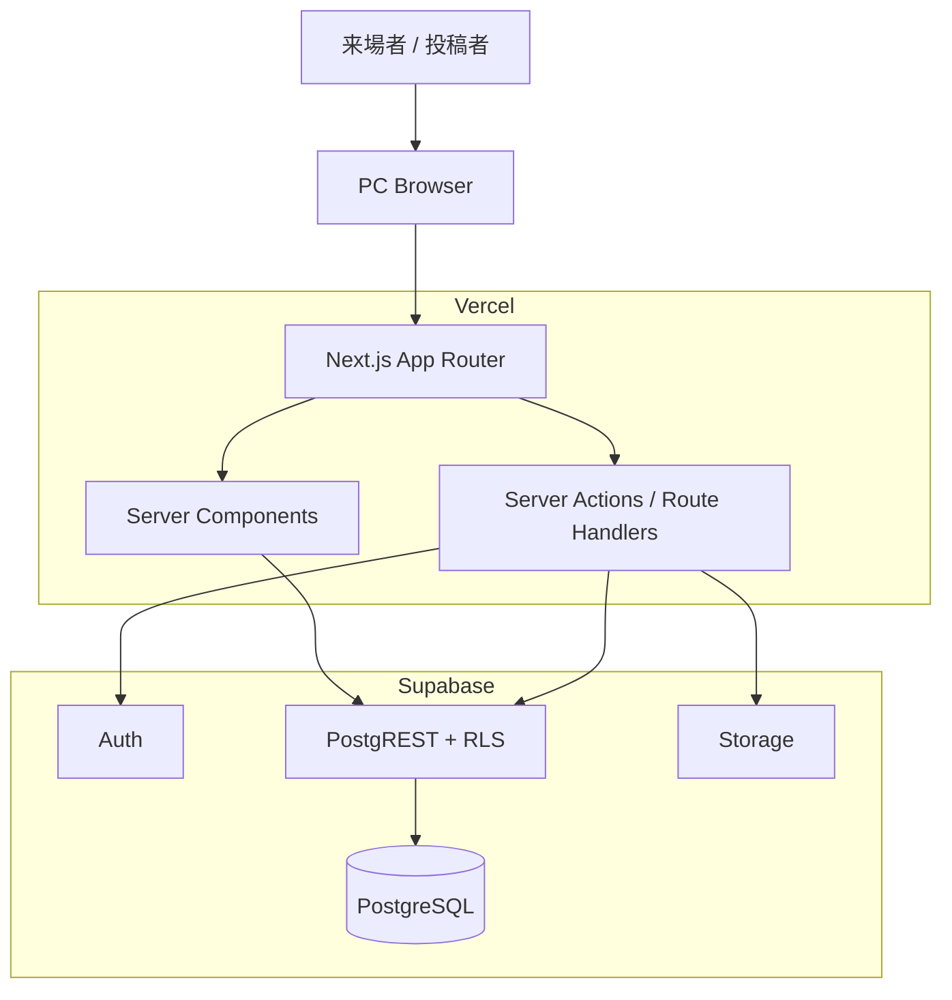
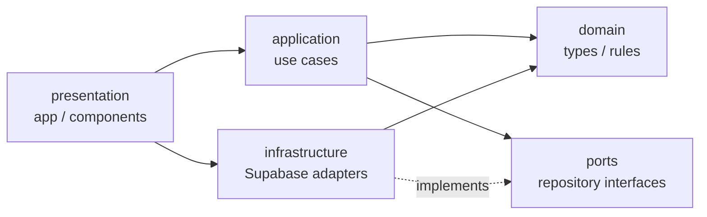
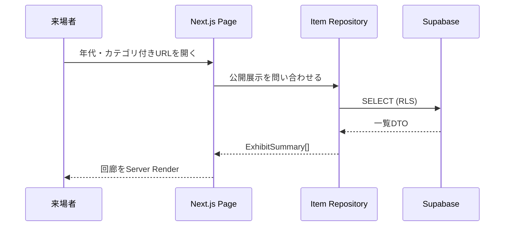
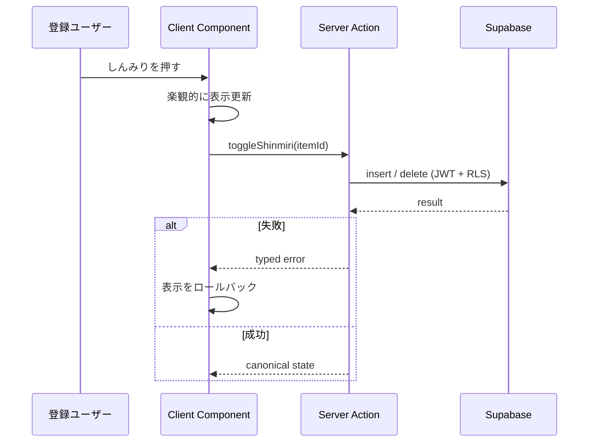
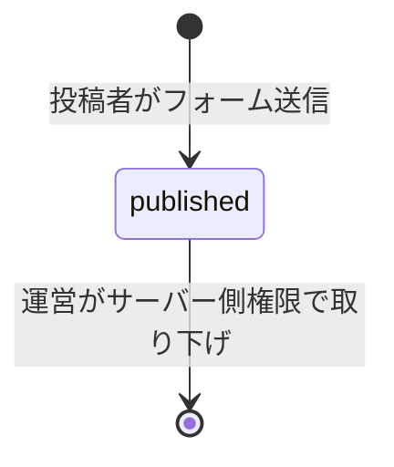

# アーキテクチャ全体図

## システム全体

## アプリ内の依存方向

`domain` はNext.js、React、Supabaseへ依存しない。薄い読み取り処理ではpresentationからinfrastructureを直接利用できるが、認可や複数更新を含む処理はapplicationを経由する。

## 主要データフロー

### 展示を閲覧する

### しんみりを付ける

### 展示候補を投稿する

投稿は保存と同時に公開され、以降は投稿者本人でも編集・削除できない。運営にも編集削除は不可。

## デプロイ単位

- Web: Vercel Preview / Production
- Auth・DB・Storage: Supabase環境ごと
- スキーマ: `supabase/migrations` を順番に適用
- 環境変数: VercelとSupabaseの管理画面で値を管理し、名前だけを `.env.example` に記載
