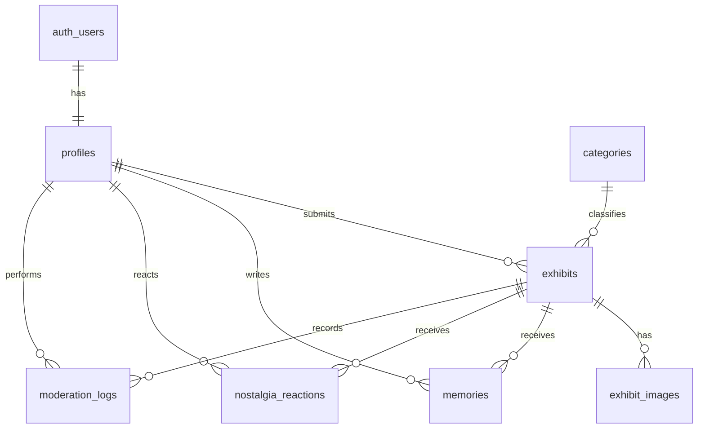

# データベース設計

Supabase PostgreSQLの設計意図を管理する。実行されるschemaの正は `supabase/migrations/*.sql` とし、実装開始後は両者を同じPRで同期する。

## ER図（案）

## 共通ルール

- table / column / constraint: `snake_case`
- 主キー: UUIDの `id`
- 時刻: `timestamptz` の `created_at`, `updated_at`
- ユーザー参照: `auth.users(id)` へのUUID外部キー
- 年だけを表す値: `smallint`。開始年は終了年以下というCHECKを持つ
- ユーザー投稿は原則物理削除せず、`deleted_at` または状態で非表示にする
- 全ユーザーデータtableでRLSを有効化する

## テーブル一覧

| table | 役割 | 公開読取 |
| --- | --- | --- |
| `profiles` | 生まれ年、表示名、role | 自分のみ |
| `categories` | 展示カテゴリmaster | 可 |
| `exhibits` | 展示本体と審査状態 | `published`のみ |
| `exhibit_images` | 画像path、alt、出典・権利情報 | 公開展示分のみ |
| `memories` | 展示コメント | 非削除かつ公開展示分 |
| `nostalgia_reactions` | しんみり | 集計のみ公開 |
| `moderation_logs` | 審査履歴 | 運営のみ |

## 主要列

### `profiles`

| column | type | rule |
| --- | --- | --- |
| `id` | uuid | PK、`auth.users.id` |
| `display_name` | text | 1〜40文字 |
| `birth_year` | smallint nullable | 合理的な範囲をCHECK |
| `role` | text | `user` / `moderator` / `admin` |
| `created_at`, `updated_at` | timestamptz | NOT NULL |

### `categories`

`id`, `slug`（UNIQUE）, `name`, `display_order`, `is_active`。初期値は「おかし」「たべもの」「テレビ」「おんがく」「ゲーム」「ほん」「できごと」「その他」。

### `exhibits`

`id`, `title`, `slug`, `summary`, `description`, `category_id`, `start_birth_year`, `end_birth_year`, `status`, `submitted_by`, `published_at`, `created_at`, `updated_at`。

`status` は `draft`, `pending`, `changes_requested`, `published`, `rejected`, `archived` に限定する。`slug` は公開URL用にUNIQUEとする。

### `exhibit_images`

`id`, `exhibit_id`, `storage_path`, `alt_text`, `source_name`, `source_url`, `license_note`, `display_order`, `created_at`。公開前に権利確認情報を必須とするかは運用決定後に制約化する。

### `memories`

`id`, `exhibit_id`, `author_id`, `body`, `created_at`, `deleted_at`, `moderated_at`, `moderated_by`。`body` は1〜500文字相当をアプリとDBで検証する。

### `nostalgia_reactions`

`exhibit_id`, `profile_id`, `created_at`。主キーまたはUNIQUEを `(exhibit_id, profile_id)` とし、1人1展示1件をDBで保証する。

### `moderation_logs`

`id`, `exhibit_id`, `actor_id`, `from_status`, `to_status`, `reason`, `created_at`。監査用途のため一般ユーザーによる更新・削除を許可しない。

## RLS方針

| 対象 | SELECT | INSERT | UPDATE / DELETE |
| --- | --- | --- | --- |
| profiles | 本人 | Auth連動作成 | 本人。role変更不可 |
| exhibits | 公開済み、本人の投稿、運営 | ログイン本人、初期状態制限 | 本人は公開前の許可項目、運営は審査 |
| memories | 公開展示の非削除分 | ログイン本人 | 本人削除、運営非表示 |
| reactions | 件数集計、自分の状態 | ログイン本人 | 本人のみ |
| moderation_logs | 運営 | 運営または安全なDB関数 | 原則不可 |

## インデックス候補

- `exhibits(status, category_id, published_at desc)`
- `exhibits(start_birth_year, end_birth_year)`
- `memories(exhibit_id, created_at desc)` WHERE `deleted_at is null`
- `nostalgia_reactions(exhibit_id)`

実データとquery planを確認せず過剰に追加しない。
