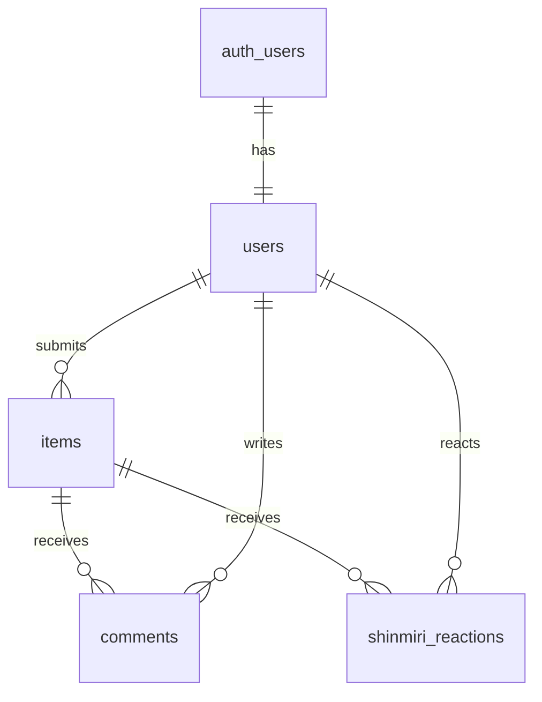

# データベース設計

Supabase PostgreSQLの設計意図を管理する。ハッカソンの開発スピードを最優先とし、テーブル結合を最小限に抑えたフラットでシンプルな構成を採用する。

## ER図

## 共通ルール

- table / column / constraint: `snake_case`
- 主キー: UUIDの `id`（`uuid_generate_v4()`）
- 時刻: `timestamptz` の `created_at`, `updated_at`
- ユーザー参照: `auth.users(id)` へのUUID外部キー
- 開発スピード優先のため、現在は**RLSを一時的に無効化**して進行（ハッカソン最終日の発表前に有効化予定）
- リアルタイム通信: `comments`, `shinmiri_reactions` テーブルでSupabase Realtimeを有効化

## テーブル一覧

| table | 役割 | 備考 |
| --- | --- | --- |
| `users` | ユーザー情報 | Authと連動。プロフィール情報（名前）を保持 |
| `items` | 展示品本体 | 画像URLやカテゴリを別テーブルにせず直接保持 |
| `comments` | コメント | Supabase Realtime通信対象 |
| `shinmiri_reactions` | しんみり | Supabase Realtime通信対象 |

## 主要列

### `users`

| column | type | rule |
| --- | --- | --- |
| `id` | uuid | PK、`auth.users.id` (ON DELETE CASCADE) |
| `user_name` | varchar | NOT NULL |
| `created_at`, `updated_at` | timestamptz | DEFAULT NOW() |

### `items`

| column | type | rule |
| --- | --- | --- |
| `id` | uuid | PK、DEFAULT `uuid_generate_v4()` |
| `user_id` | uuid | FK `users.id` (ON DELETE CASCADE) |
| `title` | varchar | NOT NULL |
| `description` | text | |
| `category` | varchar | |
| `image_url` | text | 画像のStorageパスまたはURL |
| `year` | int | NOT NULL（流行した年代） |
| `created_at` | timestamptz | DEFAULT NOW() |

### `comments`

| column | type | rule |
| --- | --- | --- |
| `id` | uuid | PK、DEFAULT `uuid_generate_v4()` |
| `item_id` | uuid | FK `items.id` (ON DELETE CASCADE) |
| `user_id` | uuid | FK `users.id` (ON DELETE CASCADE) |
| `content` | text | NOT NULL |
| `created_at` | timestamptz | DEFAULT NOW() |

### `shinmiri_reactions`

| column | type | rule |
| --- | --- | --- |
| `id` | uuid | PK、DEFAULT `uuid_generate_v4()` |
| `item_id` | uuid | FK `items.id` (ON DELETE CASCADE) |
| `user_id` | uuid | FK `users.id` (ON DELETE CASCADE) |
| `created_at` | timestamptz | DEFAULT NOW() |

※制約: `UNIQUE(item_id, user_id)` を設定し、1ユーザーにつき1展示品1回までのリアクションをDBレベルで保証する。

## RLS方針（※現在は全アクセス許可、発表・公開前に適用予定）

| 対象 | SELECT | INSERT | UPDATE / DELETE |
| --- | --- | --- | --- |
| `users` | 誰でも可 | Auth連動作成 | 本人のみ |
| `items` | 誰でも可 | ログイン本人 | 本人のみ |
| `comments` | 誰でも可 | ログイン本人 | 本人のみ |
| `shinmiri_reactions` | 誰でも可 | ログイン本人 | 本人のみ |

## インデックス候補

ハッカソン期間中はデータ量が限られるため、一旦インデックスは設定せずに進行する。必要に応じてパフォーマンスチューニング時に追加を検討する。