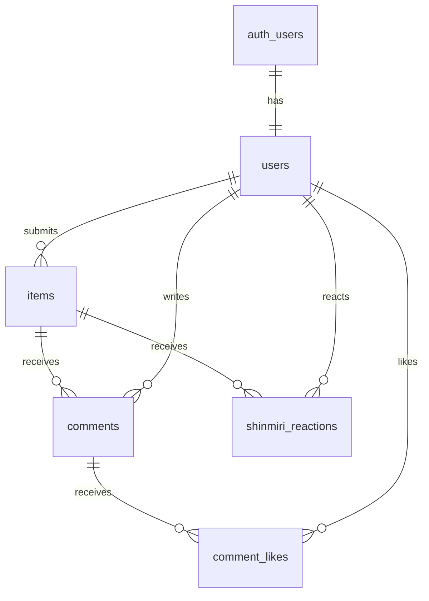

# データベース設計

Supabase PostgreSQLの設計意図を管理する。サークル内ハッカソン用プロダクトのため開発スピードを最優先とし、テーブル結合を最小限に抑えたフラットでシンプルな構成を採用する。

## ER図

## 共通ルール

- table / column / constraint: `snake_case`
- 展示品を表すDB tableは `items` に固定する。アプリケーション層・UI・URLの用語は `exhibit` 系で統一し、DB列名の `item_id` とは区別する
- 主キー: UUIDの `id`（`gen_random_uuid()`。拡張機能が不要なため `uuid_generate_v4()` は使わない）
- 時刻: `timestamptz`。更新される可能性のあるtableだけ `updated_at` を持つ
- ユーザー参照: `auth.users(id)` を起点としたUUID外部キー
- **RLSはtable作成と同じmigrationで有効化する。** 無効のままPreview / Productionへ出さない
- 生まれ年はDBで管理しない。クライアント側の一時保存のみとする

## テーブル一覧

| table | 役割 | 備考 |
| --- | --- | --- |
| `users` | ユーザー情報 | Authと連動。表示名のみを保持し、個人情報を持たない |
| `items` | 展示品本体 | 画像・カテゴリを別テーブルにせず直接保持 |
| `comments` | コメント | 投稿と本人による物理削除のみ。編集不可 |
| `comment_likes` | コメントいいね | 1ユーザー1コメント1件 |
| `shinmiri_reactions` | しんみり | 1ユーザー1展示1件 |

## 主要列

### `users`

| column | type | rule |
| --- | --- | --- |
| `id` | uuid | PK、`auth.users.id` (ON DELETE CASCADE) |
| `user_name` | varchar | NOT NULL |
| `created_at`, `updated_at` | timestamptz | NOT NULL DEFAULT `now()` |

生まれ年を持たないため、このtableは表示名のみの公開情報となる。匿名SELECTを許可しても個人情報を露出しない。

### `items`

| column | type | rule |
| --- | --- | --- |
| `id` | uuid | PK、DEFAULT `gen_random_uuid()` |
| `user_id` | uuid | FK `users.id` (ON DELETE CASCADE)、NULL可 |
| `title` | varchar | NOT NULL。Unicode空白を除くtrim後1〜100文字 |
| `description` | text | NOT NULL。Unicode空白を除くtrim後1〜500文字 |
| `category` | varchar | NOT NULL。CHECK制約で `おかし` / `ゲーム` / `たべもの` / `ほん` / `できごと` / `ガジェット` / `インターネット` に限定 |
| `theme` | varchar | 表示テーマ識別子（`gummy`, `watch` など。未設定時はコードでフォールバック） |
| `image_url` | text | Supabase Storage内の公開画像URL（投稿時は画像添付必須。既存seed等で未指定時はテーマアートへフォールバック） |
| `year` | int | 展示品の年代（西暦4桁、1900年〜現在年、例: `2004`） |
| `created_at`, `updated_at` | timestamptz | NOT NULL DEFAULT `now()` |

制約・運用:

- `image_url` は額縁に飾る展示写真の公開画像URLを保持する。新規投稿時は画像アップロードが必須となり、初期seed等で未指定の場合はテーマアートを表示する
- `year` は展示アイテムの年代（流行年や発売年など）を表す
- `user_id` が `NULL` の行は seed で投入した初期展示を表す。RLSの所有者判定が成立しないため、誰も更新・削除できない

### `comments`

| column | type | rule |
| --- | --- | --- |
| `id` | uuid | PK、DEFAULT `gen_random_uuid()` |
| `item_id` | uuid | FK `items.id` (ON DELETE CASCADE)、NOT NULL |
| `user_id` | uuid | FK `users.id` (ON DELETE CASCADE)、NOT NULL |
| `content` | text | NOT NULL。CHECK制約でUnicode空白を除くtrim後1〜500文字 |
| `created_at`, `updated_at` | timestamptz | NOT NULL DEFAULT `now()` |

編集を提供しないため `updated_at` を持たない。本人削除は物理削除とする。

### `comment_likes`

| column | type | rule |
| --- | --- | --- |
| `id` | uuid | PK、DEFAULT `gen_random_uuid()` |
| `comment_id` | uuid | FK `comments.id` (ON DELETE CASCADE)、NOT NULL |
| `user_id` | uuid | FK `users.id` (ON DELETE CASCADE)、NOT NULL |
| `created_at`, `updated_at` | timestamptz | NOT NULL DEFAULT `now()` |

制約: `UNIQUE(comment_id, user_id)`。ログインユーザーは付与・解除でき、匿名ユーザーは件数だけを閲覧する。コメントが物理削除されると、関連するいいねもCASCADEで削除される。

### `shinmiri_reactions`

| column | type | rule |
| --- | --- | --- |
| `id` | uuid | PK、DEFAULT `gen_random_uuid()` |
| `item_id` | uuid | FK `items.id` (ON DELETE CASCADE)、NOT NULL |
| `user_id` | uuid | FK `users.id` (ON DELETE CASCADE)、NOT NULL |
| `created_at`, `updated_at` | timestamptz | NOT NULL DEFAULT `now()` |

制約: `UNIQUE(item_id, user_id)`。1ユーザーにつき1展示1回までをDBレベルで保証する。行を更新しないため `updated_at` を持たない。

## RLS方針

全tableでRLSを有効化する。運営ロールが存在しないため、判定は「匿名 / ログイン済み / 所有者」の3種類だけで済む。

| table | SELECT | INSERT | UPDATE | DELETE |
| --- | --- | --- | --- | --- |
| `users` | 全員 | トリガー経由のみ | 本人 | 不可（`auth.users` 削除にCASCADE） |
| `items` | 全員 | ログイン済み・本人名義 | 不可（編集なし） | 不可（取り下げは運営がサーバー側権限で対応） |
| `comments` | 全員 | ログイン済み・本人名義 | 不可（編集なし） | 本人 |
| `comment_likes` | 本人の行のみ | ログイン済み・本人名義 | 不可 | 本人 |
| `shinmiri_reactions` | 全員 | ログイン済み・本人名義 | 不可 | 本人 |

- INSERTは `WITH CHECK (auth.uid() = user_id)` で本人名義を強制する
- DELETEは `USING (auth.uid() = user_id)` で所有者を照合する。ただし `items` は公開後の取り下げを認めないため、policyもtable権限も与えない
- `users` の所有者列は `id`、それ以外の所有者付きtableは `user_id` を使う
- `comment_likes` の匿名件数は生テーブルを公開せず、集計RPC `get_comment_like_counts` から取得する
- 公開状態（status）を持たないため、SELECTに条件分岐は不要

## `users` の自動作成

RLS有効下ではクライアントから `users` をINSERTできない。`auth.users` へのINSERTに対する `SECURITY DEFINER` トリガーを唯一の作成経路とする。

- `user_name` は利用者が指定した `user_name` / `display_name` から取得し、無い場合はメールアドレスを使わずランダムな既定名を生成する
- トリガーが無いと、サインアップ直後の投稿・コメントが外部キー違反で失敗する

## `updated_at` の更新

`users` に `BEFORE UPDATE` トリガーを設定し、`now()` を代入する。`items`、`comments`、`comment_likes`、`shinmiri_reactions` は更新しないため不要。

## インデックス

- `comments(item_id, created_at DESC)` — 展示詳細のコメント取得
- `items(category)` / `items(year)` — F-01の絞り込み
- `comment_likes` は `UNIQUE(comment_id, user_id)` が `comment_id` 先頭の複合indexになるため追加不要
- `shinmiri_reactions` は `UNIQUE(item_id, user_id)` が `item_id` 先頭の複合indexになるため追加不要

データ量が少ないうちは効果が小さいが、記述コストがほぼ無いため最初から入れる。

## しんみり件数の取得

`items` に非正規化したカウント列を持たせず、`shinmiri_reactions` を集計する。一覧では展示ごとに問い合わせず、`item_id` ごとの件数を1クエリでまとめて取得する。

## コメントいいね件数の取得

`comments` に非正規化したカウント列を持たせず、`get_comment_like_counts` RPCで集計する。生のいいね行を匿名へ公開せず、`comment_id` と件数だけを返す。

## Realtime

MVPでは有効化しない。PRDのMVP対象外にリアルタイム機能が含まれ、コメント・しんみりの反映はServer Actionと再検証で足りるため（[API_DESIGN.md](./API_DESIGN.md)）。

## スコープ外の記録

サークル内ハッカソン用途のため、以下を意図的に持たない。不特定多数へ公開する場合は再検討する。

| 省略したもの | 影響 |
| --- | --- |
| コメントの論理削除・運営による非表示 | 不適切な投稿へ運営が対処する手段がない |
| 画像の出典情報 | 出典URLやライセンス情報の管理、利用者への確認操作は行わない |
| 生まれ年のDB保存 | 端末内の一時保存に留まり、再ログインでは復元されない |
| 展示のslug | URLは `/exhibits/{uuid}` になる。後からslugを導入すると既存URLが変わる |
| コメントの論理削除 | 物理削除のため、後から論理削除へ移行してもデータを復元できない |
